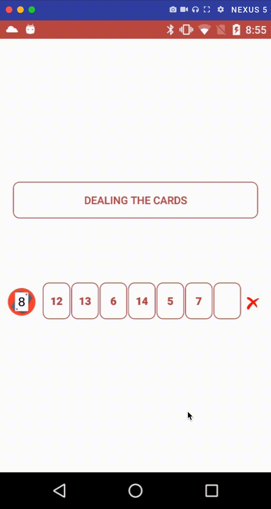

# pokerApp

this app complies with the following use cases:
a set of cards in a list represent a poker ladder (5 cards with consecutive values) or not.
The cards always have values between 2 and 14, where 14 is the AS. Note that the AS counts as 1. The
number of cards can vary, but is never more than 7.
